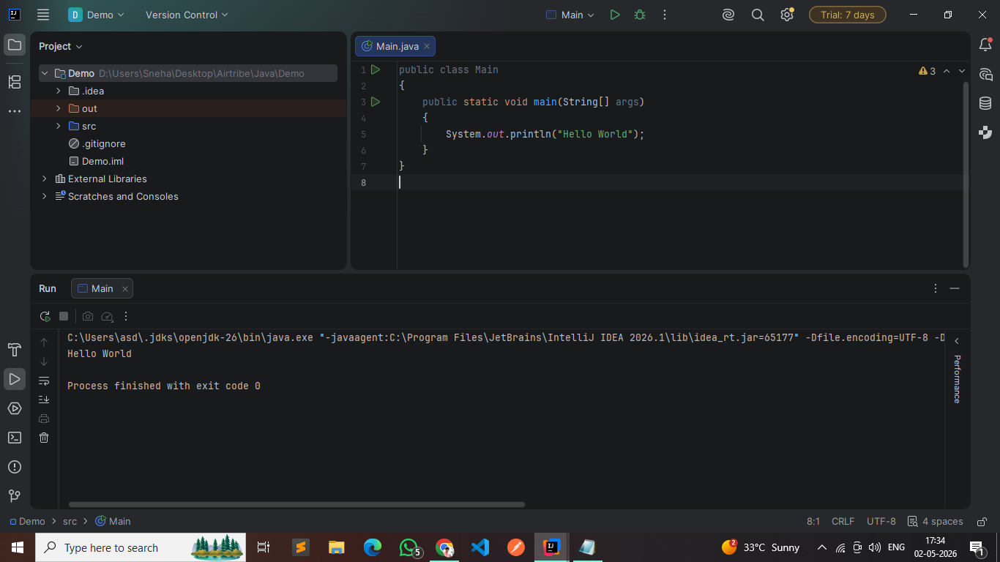

# Setup Instructions – LearnTrack Project

## 1. JDK Installation & Version

### How to Check JDK Version in IntelliJ IDEA

You can verify the JDK version used in your project using the following methods:

#### Method 1: From Project Structure
1. Open IntelliJ IDEA
2. Go to **File → Project Structure** (Shortcut: `Ctrl + Alt + Shift + S`)
3. Click on **Project**
4. Check the **Project SDK** field

This shows the JDK version being used by your project.

📸 **[Demo : Hello World]**

---

#### Method 2: From Terminal (Inside IntelliJ or System)

1. Open Terminal in IntelliJ (bottom panel) OR system terminal
2. Run the command:

```bash
java -version